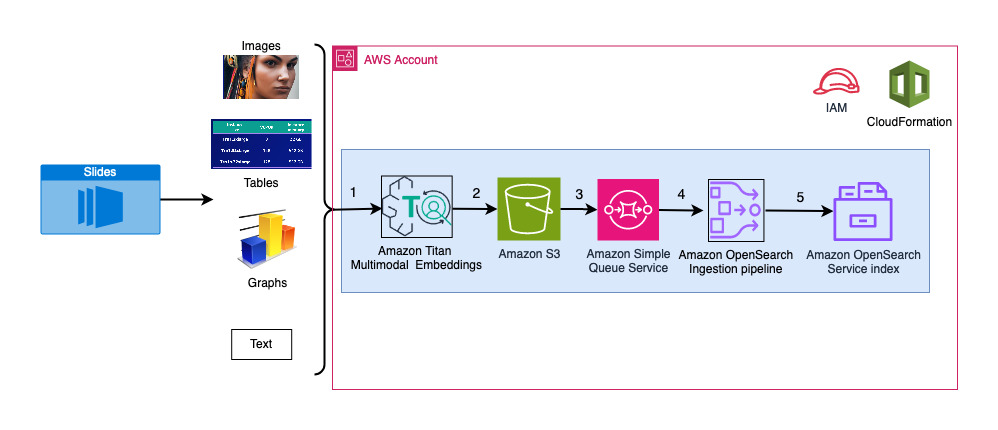
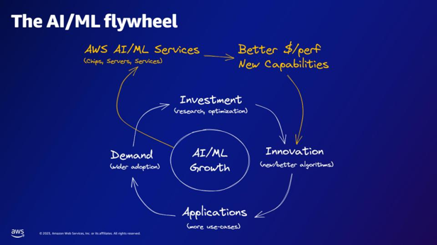

Part 1: Talk to your slide deck (Multimodal RAG) using foundation models
(FMs) hosted on Amazon Bedrock and Amazon SageMaker
================

*Amit Arora*, *Archana Inapudi*, *Manju Prasad*, *Antara Raisa*

With the advent of generative AI, today’s foundation models (FMs), such
as the large language models (LLMs) Claude 2 and Llama 2 can perform a
range of (generative) tasks such as question answering, summarization, content creation
on “text” data. Real world data however, exists in multiple
modalities such as “text”, “images”, “video” and “audio”. Take a
PowerPoint slide deck for example, It could contain information in the
form of text, or embedded in graphs, tables and pictures. In this blog,
we present a solution that uses Multimodal FMs such as the [Amazon Titan
Multimodal
Embeddings](https://docs.aws.amazon.com/bedrock/latest/userguide/titan-multiemb-models.html)
model and [LLaVA 1.5](https://arxiv.org/pdf/2310.03744.pdf), to perform
similar generative tasks on multimodal data.

## Solution overview

The solution presented provides an implementation for answering
questions using information contained in the text and visual elements of
a slide deck. The design relies on the concept of Retrieval Augmented
Generation (RAG). Traditionally, RAG has been associated with textual
data that can be processed by LLMs. In this blog, we extend RAG to
include images as well. This provides a powerful search capability to
extract contextually relevant content from visual elements like tables
and graphs along with text.

There are different ways to design a RAG solution that includes images.
We have presented one approach here and will follow-up with an alternate
approach in the second blog of this three-part blog series.

This solution includes the following components:

- [Amazon Titan Multimodal
  Embeddings](https://docs.aws.amazon.com/bedrock/latest/userguide/titan-multiemb-models.html)
  model: this FM is used to generate embeddings for the content in the
  slide deck used in this blog. As a multimodal model, this Titan model
  can process text, image or a combination as input and generate
  embeddings. The Titan Multimodal Embeddings model generates vectors
  (embeddings) of dimension 1024 and is accessed via the Amazon Bedrock
  service.
- [Large Language-and-Vision Assistant
  (LLaVA)](https://llava-vl.github.io/): LLaVA is an open source
  multimodal model for visual and language understanding and is used to
  interpret the data in the slides, including visual elements such as
  graphs and tables. We use the 7-billion parameter version [LLaVA
  1.5-7b](https://huggingface.co/liuhaotian/llava-v1.5-7b) in this
  solution.
- [Amazon
  SageMaker](https://docs.aws.amazon.com/sagemaker/latest/dg/whatis.html):
  the LLaVA model is deployed on a SageMaker endpoint using
  SageMaker hosting services and we use the resulting endpoint to run
  inferences against the LLaVA model. We also use SageMaker Notebooks to
  orchestrate and demonstrate this solution end-to-end.
- [Amazon OpenSearch Service
  Serverless](https://docs.aws.amazon.com/opensearch-service/latest/developerguide/serverless-overview.html):
  OpenSearch Service Serverless is an on-demand serverless configuration
  for Amazon OpenSearch Service. We use OpenSearch Service Serverless as
  a vector database for storing embeddings generated by the Titan
  Multimodal Embeddings model. An index created in the OpenSearch
  Service Serverless collection serves as the vector store for our RAG
  solution.
- [Amazon OpenSearch
  Ingestion](https://docs.aws.amazon.com/opensearch-service/latest/developerguide/ingestion.html)
  (OSI): OSI is a fully managed, serverless data collector that delivers
  data to Amazon OpenSearch Service domains and OpenSearch Serverless
  collections. In this blog, we are using an OSI pipeline to deliver
  data to the OpenSearch Serverless vector store.

## Solution design

The solution design consists of two parts - Ingestion and User
interaction. During ingestion, we process the input slide deck by
converting each slide into an image, generate embeddings for these
images and then populate the vector data store. These steps are
completed prior to the user interaction steps.

In the User interaction phase, a question from the user is converted
into embeddings and a similarity search is run on the vector database to
find a slide that could potentially contain answers to user question. We
then provide this slide (in the form of an image file) to the LLaVA
model and the user question as a prompt to generate an answer to the
query. All the code for this post is available in the
[GitHub](https://github.com/aws-samples/multimodal-rag-on-slide-decks/tree/main/Blog1-TitanEmbeddings-LVM)
repo.

### Ingestion steps:

<figure>

<figcaption aria-hidden="true">Figure 1: Ingestion
architecture</figcaption>
</figure>

1.  Slides are converted to image files (one per slide) in the JPG
    format and passed to the Titan Multimodal Embeddings model to
    generate embeddings. In our blog, we use this slide deck titled
    [Train and deploy Stable Diffusion using AWS Trainium & AWS
    Inferentia](https://d1.awsstatic.com/events/Summits/torsummit2023/CMP301_TrainDeploy_E1_20230607_SPEdited.pdf)
    from the AWS Summit in Toronto, June 2023 to demonstrate the
    solution.

    - The sample deck has 31 slides and thus we generate 31 sets of
      vector embeddings, each with 1024 dimensions. We add additional
      metadata fields to these generated vector embeddings and create a
      JSON file. These additional metadata fields can be used to perform
      rich search queries using OpenSearch’s powerful search
      capabilities.

2.  The generated embeddings are put together in a single JSON file that
    is uploaded to Amazon S3

3.  Via S3 Event Notification, an event is put on the Amazon Simple
    Queue Service (SQS) queue.

4.  This event on the SQS queue acts as a trigger to run the OSI
    pipeline which in turn ingests the data (JSON file) as documents
    into the OpenSearch Service Serverless index.

    - Note that the OpenSearch Service Serverless index is configured as
      the sink for this pipeline and it is created as part of the
      OpenSearch Service Serverless collection.

### User interaction steps:

<figure>

<figcaption aria-hidden="true">Figure 2: User interaction
architecture</figcaption>
</figure>

1.  A user submits a question related to the slide deck that has been
    ingested.
2.  The user input is converted into embeddings using the Titan
    Multimodal Embeddings model accessed via Bedrock. An OpenSearch
    vector search is performed using these embeddings. We perform a
    K-Nearest Neighbor (`k=1`) search to retrieve the most relevant
    embedding matching the user query. Setting `k=1` retrieves the most
    relevant slide to the user question.
3.  The metadata of the response from OpenSearch Services Serverless
    contains a path to the image corresponding to the most relevant
    slide.
4.  A prompt is created by combining the user question and the image
    path and provided to LLaVA hosted on SageMaker. The LLaVA model is
    able to understand the user question and answer it by examining the
    data in the image.
5.  Result of this inference is returned to the user.

These steps are discussed in detail in the following sections. See
Results section for screenshots and details on the output.

## Prerequisites

To implement the solution provided in this post, you should have an [AWS
account](https://signin.aws.amazon.com/signin?redirect_uri=https%3A%2F%2Fportal.aws.amazon.com%2Fbilling%2Fsignup%2Fresume&client_id=signup)
and familarity with FMs, Bedrock, SageMaker and OpenSearch Service.

This solution uses the Titan Multimodal Embeddings model. Ensure that
this model is enabled for use in Amazon Bedrock. In AWS Management
Console → Amazon Bedrock, select Model access. If Titan Multimodal
Embeddings is enabled, the Access status will state “Access granted” as
below.

<figure>

<figcaption aria-hidden="true">Figure 3: User interaction
architecture</figcaption>
</figure>

If the model is not available, enable access to the model by clicking on
“Manage Model Access”, selecting “Titan Multimodal Embeddings G1” and
clicking on Request model access. The model is enabled for use
immediately.

<figure>

<figcaption aria-hidden="true">Figure 4: User interaction
architecture</figcaption>
</figure>

## Use AWS CloudFormation template to create the solution stack

| AWS Region |                                                                                                                                    Link                                                                                                                                     |
|:----------:|:---------------------------------------------------------------------------------------------------------------------------------------------------------------------------------------------------------------------------------------------------------------------------:|
| us-east-1  | [](https://console.aws.amazon.com/cloudformation/home?region=us-east-1#/stacks/new?stackName=multimodal-stack&templateURL=https://aws-blogs-artifacts-public.s3.amazonaws.com/artifacts/ML-16123/template.yml) |
| us-west-2  | [](https://console.aws.amazon.com/cloudformation/home?region=us-west-2#/stacks/new?stackName=multimodal-stack&templateURL=https://aws-blogs-artifacts-public.s3.amazonaws.com/artifacts/ML-16123/template.yml) |

After the stack is created successfully, navigate to the stack’s
`Outputs` tab on the AWS CloudFormation console and note the values for
`MultimodalCollectionEndpoint`, we will use it in the subsequent steps.

<figure>

<figcaption aria-hidden="true">Figure 5: CloudFormation stack
outputs</figcaption>
</figure>

The CloudFormation template creates the following resources:

- `IAM roles`: the following two IAM roles are created. Update these
  roles to apply least-privilege permissions as discussed in [Security
  best
  practices](https://docs.aws.amazon.com/IAM/latest/UserGuide/best-practices.html#grant-least-privilege).
  - `SMExecutionRole` with S3, SageMaker, OpenSearch Service, and
    Bedrock full access.
  - `OSPipelineExecutionRole` with access to specific SQS and OSI
    actions.
- `SageMaker Notebook`: all code for this post is run via this notebook.
- `OpenSearch Service Serverless collection`: vector database for
  storing and retrieving embeddings.
- `OSI Pipeline`: pipeline for ingesting data into OpenSearch Service
  Serverless.
- `S3 bucket`: all data for this post is stored in this bucket.
- `SQS Queue`: events for triggering the OSI pipeline run are put on
  this queue.

### OSI pipeline setup

The CloudFormation template sets up the Pipeline configuration required
to setup OSI Pipeline with S3-SQS processing as source and OpenSearch
Serverless index as sink. Any objects created in the specified S3 bucket
and prefix (`multimodal/osi-embeddings-json`) will trigger SQS
notifications that will be used by the OSI pipeline to ingest data into
OpenSearch Service Serverless.

The CloudFormation template also creates
[Network](https://docs.aws.amazon.com/opensearch-service/latest/developerguide/serverless-network.html),
[Encryption](https://docs.aws.amazon.com/opensearch-service/latest/developerguide/serverless-encryption.html)
and [Data
Access](https://docs.aws.amazon.com/opensearch-service/latest/developerguide/serverless-data-access.html)
policies required for OpenSearch Serverless Collection. Update these
policies to apply least-privilege permissions as discussed in Security
best practices.

Note that the CloudFormation template name is referenced in SageMaker
notebooks. If the default name is changed, make sure you update the same
in [`globals.py`](./notebooks/globals.py).


## Testing the solution

Once the prerequisite steps are complete and the CloudFormation stack
has been created successfully, we are now ready to run the “talk to your
slide deck” implementation:

1.  On the SageMaker console, choose **Notebooks** in the navigation
    pane.

2.  Select the `MultimodalNotebookInstance` and choose **Open
    JupyterLab**.

    <figure>
    
    <figcaption aria-hidden="true">Figure 6: SageMaker
    Notebooks</figcaption>
    </figure>

3.  In `File Browser`, traverse to the notebooks folder to see notebooks
    and supporting files. The notebooks are numbered in sequence of
    execution. Instructions and comments in each notebook describe the
    actions performed by that notebook. We will run these notebook one
    by one.

4.  Choose [`0_deploy_llava.ipynb`](./notebooks/0_deploy_llava.ipynb) to
    open it in JupyterLab. When the notebook is open, on the Run menu,
    choose **Run All Cells** to run the code in this notebook. This
    notebook will deploy the LLaVA-v1.5-7B model to a SageMaker
    endpoint.

    - In this notebook we download the LLaVA-v1.5-7B model from
      HuggingFace Hub, replace the `inference.py` script with
      [`llava_inference.py`](./notebooks/llava_inference.py) and create
      a `model.tar.gz` file for this model.

    - The `model.tar.gz` file is uploaded to S3 and used for deploying
      the model on SageMaker endpoint. The
      [`llava_inference.py`](./notebooks/llava_inference.py) has
      additional code to allow reading an image file from S3 and run
      inference on it.

5.  Next Choose [`1_data_prep.ipynb`](./notebooks/1_data_prep.ipynb) to
    open it in JupyterLab. When the notebook is open, on the Run menu,
    choose **Run All Cells** to run the code in this notebook. This
    notebook will download a publicly available [slide
    deck]((https://d1.awsstatic.com/events/Summits/torsummit2023/CMP301_TrainDeploy_E1_20230607_SPEdited.pdf))
    and convert each slide into the JPG file format and upload these to
    the S3 bucket for this blog.

6.  Next Choose
    [`2_data_ingestion.ipynb`](./notebooks/2_data_ingestion.ipynb) to
    open it in JupyterLab. When the notebook is open, on the Run menu,
    choose **Run All Cells** to run the code in this notebook. We do the
    following in this notebook:

    - Create an index in the OpenSearch Service Serverless collection.
      This index stores the embeddings data for the slide deck.

    ``` python
    session = boto3.Session()
    credentials = session.get_credentials()
    auth = AWSV4SignerAuth(credentials, g.AWS_REGION, g.OS_SERVICE)

    os_client = OpenSearch(
      hosts = [{'host': host, 'port': 443}],
      http_auth = auth,
      use_ssl = True,
      verify_certs = True,
      connection_class = RequestsHttpConnection,
      pool_maxsize = 20
    )

    index_body = """
    {
      "settings": {
          "index.knn": true
      },
      "mappings": {
          "properties": {
              "vector_embedding": {
                  "type": "knn_vector",
                  "dimension": 1024,
                  "method": {
                      "name": "hnsw",
                      "engine": "nmslib",
                      "parameters": {}
                  }
              },
              "image_path": {
                  "type": "text"
              },
              "metadata": {
                  "properties": {
                      "slide_filename": {
                          "type": "text"
                      },
                      "model_id": {
                          "type": "text"
                      },
                      "slide_description": {
                          "type": "text"
                      }
                  }
              }
          }
      }
    }
    """
    index_body = json.loads(index_body)
    try:
      response = os_client.indices.create(index_name, body=index_body)
      logger.info(f"response received for the create index -> {response}")
    except Exception as e:
      logger.error(f"error in creating index={index_name}, exception={e}")
    ```

    - We use Titan Multimodal Embeddings model to convert the JPG images
      created in the previous notebook into vector embeddings. These
      embeddings and additional metadata (such as the S3 path of the
      image file) are stored in a JSON file and uploaded to S3. Note
      that a single JSON file is created which contains documents for
      all the slides (images) converted into embeddings. The following
      code snippet shows how an image (in the form of a Base64 encoded
      string) is converted into embeddings.

    ``` python
    def get_multimodal_embeddings(bedrock: botocore.client, image: str) -> np.ndarray:
        body = json.dumps(dict(inputImage=image))
        try:
            response = bedrock.invoke_model(
                body=body, modelId=g.FMC_MODEL_ID, accept=g.ACCEPT_ENCODING, contentType=g.CONTENT_ENCODING
            )
            response_body = json.loads(response.get("body").read())
            embeddings = np.array([response_body.get("embedding")]).astype(np.float32)
        except Exception as e:
            logger.error(f"exception while image(truncated)={image[:10]}, exception={e}")
            embeddings = None

        return embeddings
    ```

    - This action triggers the OpenSearch Ingestion pipeline ingest
      process that processes the file and ingests into the OpenSearch
      Service Serverless Index. Here is a sample of the JSON file
      created (a vector with 4 dimensions is shown below. Titan
      Multimodal Embeddings model generates 1024 dimensions).

    ``` python
    [
      {
        "image_path": "s3://<your-bucket-name>/path/to/file1.json",
        "metadata": {
          "slide_filename": "mypowerpoint1.pptx",
          "model_id": "amazon.titan-embed-image-v1",
          "slide_description": "This is a test slide deck"
        },
        "vector_embedding": [
          657.6052386529958,
          0.8865137233123771,
          763.870264592026,
          ...
        ]
      }
      ...
    ] 
    ```

7.  Next Choose
    [`3_rag_inference.ipynb`](./notebooks/3_rag_inference.ipynb) to open
    it in JupyterLab. When the notebook is open, on the Run menu, choose
    **Run All Cells** to run the code in this notebook. This notebook
    implements the RAG solution: we convert the user question into
    embeddings, find a similar image (slide) from the vector database
    and then provide the retrieved image to LLaVA to generate an answer
    to the user question.

    - We use the following prompt template.

    ``` python
    prompt_template: str = """Pretend that you are a helpful assistant that answers questions about content in a slide deck. 
      Using only the information in the provided slide image answer the following question.
      If you do not find the answer in the image then say I did not find the answer to this question in the slide deck.

      {question}
    """
    ```

    - The following code snippet provides the RAG workflow.

    ``` python
    # create prompt and convert to embeddings
    question: str = "As per the AI/ML flywheel, what do the AWS AI/ML services provide?"
    prompt = prompt_template.format(question=question)
    text_embeddings = get_text_embeddings(bedrock, question)

    # vector db search
    vector_db_response: Dict = find_similar_data(text_embeddings)

    # download image for local notebook display
    s3_img_path = vector_db_response.get('hits', {}).get('hits')[0].get('_source').get('image_path')
    logger.info(f"going to answer the question=\"{question}\" using the image \"{s3_img_path}\"")

    !aws s3 cp {s3_img_path} .
    local_img_path = os.path.basename(s3_img_path)
    display(Image(filename=local_img_path))

    # Ask LLaVA
    data = {
        "image" : s3_img_path,
        "question" : prompt,
        "temperature" : 0.1,
    }
    output = predictor.predict(data)
    logger.info(f"Image={s3_img_path}\nQuestion: {question}\nAnswer: {output}\n\n")
    ```

## Results

Here is a compilation of some user questions and responses generated by
our implementation. The Question column captures the user question, and
Answer column is the textual response generated by LLaVA. Image is the
K-Nearest (`k=1`) slide match returned by the OpenSearch Service
Serverless vector search. This slide is interpreted by LLaVA to provide
the Answer

| Question                                                                                                                                     | Answer                                                                                                                                                                                     | Image                              |
|----------------------------------------------------------------------------------------------------------------------------------------------|--------------------------------------------------------------------------------------------------------------------------------------------------------------------------------------------|------------------------------------|
| How does Inf2 compare in performance to comparable EC2 instances? I need numbers.                                                            | According to the slide deck, Inf2 instances by AWS Inferentia2 offer up to 4x higher throughput and 10x lower latency compared to comparable EC2 instances.                                |  |
| As per the AI/ML flywheel, what do the AWS AI/ML services provide?                                                                           | The AWS AI/ML services provide better \$/perfer capabilities, new capabilities, and investment in innovation.                                                                              |  |
| Compared to GPT-2, how many more parameters does GPT-3 have? What is the numerical difference between the parameter size of GPT-2 and GPT-3? | According to the slide, GPT-3 has 175 billion parameters, while GPT-2 has 1.5 billion parameters. The numerical difference between the parameter size of GPT-2 and GPT-3 is 173.5 billion. |  |
| What are quarks in particle physics?                                                                                                         | I did not find the answer to this question in the slide deck.                                                                                                                              |  |

Multimodal RAG results

Feel free to extend this solution to your slide decks. Simply update the SLIDE_DECK variable in globals.py with a URL to your slide deck and run the ingestion steps detailed in Testing the solution section

## Tip

Note that you can use OpenSearch Dashboards to interact with the
OpenSearch API to run quick tests on your index and ingested data.

<figure>

<figcaption aria-hidden="true">Figure 7: OpenSearch dashboard GET
example</figcaption>
</figure>

## Cleanup

To avoid incurring future charges, delete the resources. You can do this
by deleting the stack from the CloudFormation console.

<figure>

<figcaption aria-hidden="true">Figure 8: Delete CloudFormation
Stack</figcaption>
</figure>

Additionally, delete the SageMaker Inference Endpoint created for LLaVA
inferencing. You can do this by uncommenting the cleanup step in
[`3_rag_inference.ipynb`](./notebooks/3_rag_inference.ipynb) and run the
cell or by deleting the endpoint from the SageMaker console via
SageMaker → Inference → Endpoints and then select and delete the
Endpoint.

## Conclusion

Enterprises generate new content all the time and slide decks are a
common mechanism used to share and disseminate information internally
with the organization and externally with customers or at conferences.
Over time, rich information can remain buried and hidden in non-text
modalities like graphs and tables in these slide decks. You can use this
solution and the power of multimodal FMs such as Titan Multimodal
Embeddings mode and LLaVA to discover new information or uncover new
perspectives on content in slide decks.

We encourage you to learn more by exploring [`SageMaker JumpStart`](https://aws.amazon.com/sagemaker/jumpstart/), [`Amazon Titan models`](https://aws.amazon.com/bedrock/titan/), [`Amazon Bedrock`](https://aws.amazon.com/bedrock/), and [`OpenSearch Service`](https://aws.amazon.com/opensearch-service/) and building a solution using the sample implementation provided in this post

Look out for two additional blogs as part of this series. Blog 2 will
cover another approach you could take to “talk to your slide deck”. This
approach will generate and store LLaVA inferences and use those stored
inferences to respond to user queries. Blog 3 will compare the two
approaches.


------------------------------------------------------------------------

## Author bio

Amit
Arora is an AI and ML Specialist Architect at Amazon Web Services,
helping enterprise customers use cloud-based machine learning services
to rapidly scale their innovations. He is also an adjunct lecturer in
the MS data science and analytics program at Georgetown University in
Washington D.C.

<br><br>

Manju
Prasad is a Senior Solutions Architect within Strategic Accounts at
Amazon Web Services. She focuses on providing technical guidance in a
variety of domains, including AI/ML to a marquee M&E customer. Prior to
joining AWS, she has worked for companies in the Financial Services
sector and also a startup.

<br><br>

Archana
Inapudi is a Senior Solutions Architect at AWS supporting Strategic
Customers. She has over a decade of experience helping customers design
and build data analytics, and database solutions. She is passionate
about using technology to provide value to customers and achieve
business outcomes.

<br><br>

Antara
Raisa is an AI and ML Solutions Architect at Amazon Web Services
supporting Strategic Customers based out of Dallas, Texas. She also has
previous experience working with large enterprise partners at AWS, where
she worked as a Partner Success Solutions Architect for digital native
customers.
