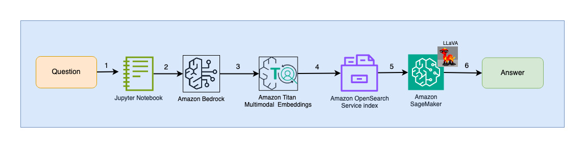

# Talk to your slide deck (Multimodal RAG) using foundation models (FMs) hosted on Amazon Bedrock and Amazon SageMaker 

## Read our blog at LINK for a descriptive walk-through 

## Introduction

With the advent of generative AI, today's foundation models (FMs), such as the large language models (LLMs) Claude 2 and Llama 2 can perform a range of (generative) tasks such as question answering, content creation and others on text data. Real world data however, exists in multiple modalities such as text, images, video and audio. Take a PowerPoint slide deck for example. It could contain information in the form of text, or embedded in graphs, tables and pictures. In this blog, we present a solution that uses Multimodal FMs such as Amazon Titan Multimodal Embeddings and LLaVA 1.5, to perform similar range of generative tasks on multimodal data.

## Solution overview

The solution presented provides an implementation for ‘talk to your slide deck’, where text and visual elements in a slide deck are used to respond to user queries. The design relies on the concept of Retrieval Augmented Generation (RAG). Traditionally, RAG has been associated with textual data that can be processed by LLMs. In this blog, we extend RAG to include images. This provides a powerful search capability to extract contextually relevant content from visual elements like tables and graphs along with text. 
There are different ways to design a RAG solution that includes images. We have presented one approach here and will follow-up in a second blog in this series with another approach. 

## Solution design 

The solution design consists of two parts - Ingestion and User interaction.  During ingestion, we process the input slide deck, generate embeddings and populate the vector data store. These steps are to be completed prior to user interaction steps.  In the User interaction phase, user prompts/queries are used to search the vector datastore and return relevant responses. 

### Ingestion steps:

1. Slides are converted to JPG (one per slide) and passed to the Titan Multimodal Embeddings model to generate embeddings. In our blog, we use this [sample](https://d1.awsstatic.com/events/Summits/torsummit2023/CMP301_TrainDeploy_E1_20230607_SPEdited.pdf) deck to demonstrate the solution. The sample deck has 31 slides, therefore the output generated has 31 sets of vector embeddings, each with 1024 dimensions. We add additional metadata fields to these generated vector embeddings and create a JSON file. These additional metadata fields can be used to perform rich search queries using OpenSearch’s powerful search capabilities. 
2. The generated JSON file is uploaded to Amazon S3
3. Via S3 Event Notification, an Amazon Simple Queue Service (SQS) queue is invoked
4. This SQS queue is the input to an OSI pipeline and triggers data collection (JSON file) by the pipeline. 
5. An OpenSearch index is configured as the sink for this pipeline. JSON files ingested via the pipeline are stored in this vector index. Note that the index is created as part of a OpenSearch Serverless collection.

### User interaction steps:

1. User submits a question/prompt related to the slide deck that has been ingested
2. User input is converted into embeddings by the Titan Multimodal Embeddings model. An OpenSearch vector search is performed using these embeddings. We perform a K-Nearest Neighbor (k=1) search to retrieve the most relevant embedding matching the user query. Therefore the output of this step is a slide 
3. This output is passed to LLaVA for interpretation of content. Note that LLaVA has been deployed to a SageMaker endpoint. This endpoint to LLaVA is invoked with input as the slide returned by the previous step. The  output of the LLaVA step is a description of the slide content
4. Result of this inference is returned to the user. 

See Results section for screenshots and details on the output. 

## Prerequisites

To implement the solution provided in this post, you should have an [AWS account](https://signin.aws.amazon.com/signin?redirect_uri=https%3A%2F%2Fportal.aws.amazon.com%2Fbilling%2Fsignup%2Fresume&client_id=signup). Use AWS CloudFormation template to create the resource stack needed for the solution.

us-east-1	link

The CloudFormation template creates the following resources:

1. SageMaker Notebooks
2. OpenSearch Serverless collection
3. OSI Pipeline
4. S3 bucket
5. SQS Queue

The CloudFormation template creates two IAM roles. Update these roles to apply least-privilege permissions as discussed in [Security best practices](https://docs.aws.amazon.com/IAM/latest/UserGuide/best-practices.html#grant-least-privilege).

1. SMExecutionRole with  S3, SageMaker, OpenSearch Service, and Bedrock full access.
2. OSPipelineExecutionRole with access to specific SQS and OSI actions.
3. 

The CloudFormation template also sets up Event Notification from S3 to SQS. Any objects created in the specified prefix (‘multimodal/osi-embeddings.-json“) will trigger SQS notifications that will be used by the OSI pipeline to hydrate the vector store. 
In addition, the CloudFormation template creates policies required to setup the OpenSearch components. Update these policies to apply least-privilege permissions as discussed in Security best practices.

1. Network, Encryption and Data Access policies required for OpenSearch Serverless Collection
2. Pipeline configuration required to setup OSI Pipeline with S3-SQS processing as source and OpenSearch Serverless index as sink 

Note that the CloudFormation template name and OpenSearch Service index name are referenced in the SageMaker notebook “3_raginference.ipynb”.  If the default names are changed, make sure you update the same in the notebook.

This solution uses the Titan multimodal embeddings model. Ensure it is enabled for use in Amazon Bedrock.

## Testing the solution 

After the prerequisite steps are complete, all resources needed to run this solution have been created. To run the ‘talk to your slide deck’ implementation: 
In AWS Management Console → SageMaker, in left panel under Notebook, select Notebook instances. Click on Open JupyterLab next to the Notebook instance created by the CloudFormation template. 
In File Browser, traverse to the notebooks folder to see notebooks and supporting files. The notebooks are numbered in sequence of execution.   Instructions and comments in each notebook describe the actions performed by that notebook. 
Notebooks 0, 1 and 2 implement the Ingestion Steps described in Solution Design. Notebook 3 implements the User Interaction Steps described in Solution Design. 

## Tip

Note that you can use OpenSearch Dashboards to interact with the OpenSearch API to run quick tests on your index and ingested data. 
(remember to add 1024 elements to the vector_embedding list)

## Cleanup

To avoid incurring future charges, delete the resources. You can do this by deleting the stack from the CloudFormation console.
Additionally, using SageMaker → Inference → Endpoints, delete the inference endpoint created for LLaVA inference to avoid incurring charges. 

## Conclusion

Enterprises generate new content all the time and slide decks are a common mechanism used to share and disseminate information. Over time, rich information can remain buried and hidden in non-text modalities like graphs and tables in these slide decks. You can use this solution and the power of Large Vision Models like LLaVA to uncover new information or even gain a new perspective on your own content. 

## Future vision

Look out for 2 additional blogs as part of this series. 
Blog 2 will cover another approach you could take when ‘talking to your slide decks’. This approach will generate and store LLaVA inferences and use those stored inferences to respond to user queries. Blog 3 will compare the two approaches.

Portions of this code are released under the Apache 2.0 License as referenced here: https://aws.amazon.com/apache-2-0/

