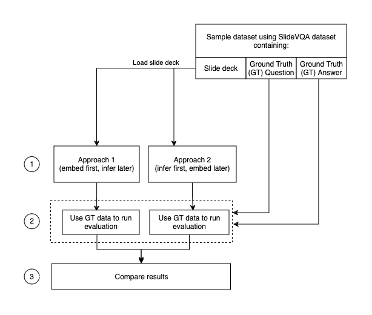

# Talk to your slide deck using multimodal foundation models on Amazon
Bedrock – Part 3

*Archana Inapudi*, *Manju Prasad*, *Amit Arora*, *Antara Raisa*

In this series, we share two approaches to gain insights on multimodal
data like text, images, and charts. In [Part
1](https://aws.amazon.com/blogs/machine-learning/talk-to-your-slide-deck-using-multimodal-foundation-models-hosted-on-amazon-bedrock-and-amazon-sagemaker-part-1/),
we presented an “embed first, infer later” solution that uses the
[Amazon Titan Multimodal
Embeddings](https://docs.aws.amazon.com/bedrock/latest/userguide/titan-multiemb-models.html)
foundation model (FM) to convert individual slides from a slide deck
into embeddings. We stored the embeddings in a vector database and then
used the [Large Language-and-Vision Assistant (LLaVA
1.5-7b)](https://llava-vl.github.io/) model to generate text responses
to user questions based on the most similar slide retrieved from the
vector database. Part 1 uses AWS services including [Amazon
Bedrock](https://aws.amazon.com/bedrock/), [Amazon
SageMaker](https://aws.amazon.com/sagemaker/), and [Amazon OpenSearch
Serverless](https://aws.amazon.com/opensearch-service/features/serverless/).

In [Part
2](https://aws.amazon.com/blogs/machine-learning/talk-to-your-slide-deck-using-multimodal-foundation-models-hosted-on-amazon-bedrock-and-amazon-sagemaker-part-2/),
we demonstrated a different approach: “infer first, embed later”. We
used [Anthropic Claude 3 Sonnet on Amazon
Bedrock](https://aws.amazon.com/bedrock/claude/) model to generate text
descriptions for each slide in the slide deck. These descriptions are
then converted into text embeddings using the [Amazon Titan Text
Embeddings](https://docs.aws.amazon.com/bedrock/latest/userguide/titan-embedding-models.html)
model and stored in a vector database. Then we used the Anthropic Claude
3 Sonnet model to generate answers to user questions based on the most
relevant text description retrieved from the vector database.

In this post, we evaluate the results from both approaches using ground
truth provided by
[SlideVQA](https://github.com/nttmdlab-nlp/SlideVQA)[^1], an open source
visual question answering dataset. You can test both approches and
evaluate the results to find the best fit for your datasets. The code
for this series is available in the [GitHub
repo](https://github.com/aws-samples/multimodal-rag-on-slide-decks/tree/main).

## Comparison of approaches

SlideVQA is a collection of publicly available slide decks, each
composed of multiple slides (in JPG format) and questions based on the
information in the slide decks. It allows a system to select a set of
evidence images and answer the question. We use SlideVQA as the single
source of truth to compare the results. It is important that you follow
the [AWS Bedrock Data
Protection](https://docs.aws.amazon.com/bedrock/latest/userguide/data-protection.html)
policies when using public datasets.

This post follows the process depicted in the following diagram. For
more details about the architecture, refer to the solution overview and
design in Parts 1 and 2 of the series.

We selected 100 random questions from SlideVQA to create a sample
dataset to test solutions from Part 1 and Part 2.

The responses to the questions in the sample dataset are as concise as
possible, as shown in the following example:

    "question": "What is the process by which the breaking of hydrogen bonds allows water to change from the liquid phase into the gaseous phase which has reached equilibrium with the liquid surface said to have done?"

    "answer": "reached saturation"

The responses from large language models (LLMs) are quite verbose:

    According to the information provided in the images, the process by which the breaking of hydrogen bonds allows water to change from the liquid phase into the gaseous phase that has reached equilibrium with the liquid surface is said to have reached saturation.

    The key points are:

    1. Evaporation involves the breaking of hydrogen bonds that hold water molecules together in the liquid phase, allowing them to transition into the gaseous (vapor) phase.

    2. Only the fastest moving water molecules with enough energy can overcome the hydrogen bonding and evaporate into the vapor phase.

    3. The evaporation process that has reached equilibrium with the liquid surface, where the vapor pressure is balanced with the evaporation rate, is described as having reached saturation.

    So in summary, the breaking of hydrogen bonds provides the mechanism for water molecules to gain enough energy to escape the liquid phase as vapor, and when this vapor has reached equilibrium with the liquid surface, it is said to have reached saturation.

We updated the prompts in each approach to provide short responses
instead of verbose responses. This helped match the output context
length to the ground truth responses in the sample dataset.

The following sections briefly discuss the solutions and dive into the
evaluation and pricing for each approach.

#### Approach 1: Embed first, infer later

Slide decks are converted into PDF images, one per slide, and embedded
using the Amazon Titan Multimodal Embeddings model, resulting in a
vector embedding of 1,024 dimensions. The embeddings are stored in an
OpenSearch Serverless index, which serves as the vector store for our
Retrieval Augmented Generation (RAG) solution. The embeddings are
ingested using an Amazon OpenSearch Ingestion pipeline.

Each question is converted into embeddings using the Amazon Titan
Multimodal Embeddings model and an OpenSearch vector search is performed
using these embeddings. We performed a k-nearest neighbor (k-NN) search
to retrieve the most relevant embedding matching the question. The
metadata of the response from the OpenSearch index contains a path to
the image corresponding to the most relevant slide.

The following prompt is created by combining the question and the image
path and is sent to Anthropic Claude 3 Sonnet to respond to the question
with a concise answer:

    Human: Your role is to provide a precise answer to the question in the <question></question> tags. Search the image provided to answer the question. Retrieve the most accurate answer in as few words as possible. Do not make up an answer. For questions that ask for numbers, follow the instructions below in the <instructions></instructions> tags. Skip the preamble and provide only the exact precise answer.

    If the image does not contain the answer to the question below, then respond with two words only - "no answer".

    Refer to the question and instructions below:

    <question>
    {question}
    </question>

    <instructions>
    1. Search for relevant data and numbers in the charts and graphs present in the image.

    2. If the image does not provide a direct answer to the user question, just say "no answer". Do not add statements like "The image does not provide..." and "It only mentions...", instead just respond with "no answer".

    3. Do not add any tags in your answer.

    4. Scan for the direct answer to the user question. If there is more than one direct answer, give everything that seems like a valid answer to the question in your response.

    5. Search for the question deeply in the image. If the question asks about any data or statistics, look for it in charts, tables, graphs first, and then in texts. Check the headings in the image.

    </instructions>

    If the image does not contain the answer, or if image does not directly answer the user question, do not respond with "The image does not provide..." or anything similar. In this case, your response should always be "no answer" and nothing else.

    Assistant: Here is my response to the question. I will give a direct and precise answer to the question if I find it and if not, I will say "no answer":

We used Anthropic Claude 3 Sonnet instead of LLaVA 1.5-7b as mentioned
in the solution for Part 1. The approach remains the same, “embed first,
infer later,” but the model that compiles the final response is changed
for simplicity and comparability between approaches.

A response for each question in the dataset is
[recorded](https://github.com/aws-samples/multimodal-rag-on-slide-decks/blob/main/Blog3-Comparison-of-Approaches/notebooks/responses-appr1.json)
in json format and compared to the ground truth provided by SlideVQA.

This approach retrieved a response for 78% of the questions on a dataset
of 100 questions, achieving a 50% accuracy on the final responses.

#### Approach 2: Infer first, embed later

Slide decks are converted into PDF images, one per slide, and passed to
the Anthropic Claude 3 Sonnet model to generate a text description. The
description is sent to the Amazon Titan Text Embeddings model to
generate vector embeddings with 1,536 dimensions. The embeddings are
ingested into an OpenSearch Serverless index using an OpenSearch
Ingestion pipeline.

Each question is converted into embeddings using the Amazon Titan Text
Embeddings model and an OpenSearch vector search is performed using
these embeddings. We performed a k-NN search to retrieve the most
relevant embedding matching the question. The metadata of the response
from OpenSearch index contains the image description corresponding to
the most relevant slide.

We create a prompt with the question and image description and pass it
to Anthropic Claude 3 Sonnet to receive a precise answer. The following
is the prompt template:

    Human: Your role is to provide a precise answer to the question in the <question></question> tags. Search the summary provided in the 

 tags to answer the question. Retrieve the most accurate answer in as few words as possible. Do not make up an answer. For questions that ask for numbers, follow the instructions below in the <instructions></instructions> tags. Skip the preamble and provide only the exact precise answer.

    If the summary does not contain the answer to the question below, then respond with two words only - "no answer".

    Refer to the question, summary, and instructions below:

    <question>
    {question}
    </question>

    

    {summary}
    

    <instructions>
    1. Search for relevant data and numbers in the summary.

    2. If the summary does not provide a direct answer to the user question, just say "no answer". Do not add statements like "The summary does not specify..." and "I do not have enough information...", instead just respond with "no answer".

    3. Do not add any tags in your answer.

    4. Scan for the direct answer to the user question. If there is more than one direct answer, give everything that seems like a valid answer to the question in your response.

    </instructions>

    If the summary does not contain the answer, or if summary does not directly answer the user question, do not respond with "The summary does not provide..." or anything similar. In this case, your response should always be "no answer" and nothing else.

    Assistant: Here is my response to the question. I will give a direct and precise answer to the question if I find it and if not, I will say "no answer":

A response for each question in the dataset is
[recorded](https://github.com/aws-samples/multimodal-rag-on-slide-decks/blob/main/Blog3-Comparison-of-Approaches/notebooks/responses-appr2.json)
and compared to the ground truth provided by SlideVQA.

The response for each question in the dataset is
[recorded](https://github.com/aws-samples/multimodal-rag-on-slide-decks/blob/main/Blog3-Comparison-of-Approaches/notebooks/responses-appr2.json)
in json format for ease of comparison.

With this approach, we received 44% accuracy on final responses with 75%
of the questions retrieving a response out of the 100 questions in the
sample dataset.

#### Analysis of results

In our testing, both approaches produced 50% or less matching results to
the questions in the sample dataset. The sample dataset contains a
random selection of slide decks covering a wide variety of topics,
including retail, healthcare, academic, technology, personal, and
travel. Therefore, for a generic question like “What are examples of
tools that can be used?” that lacks additional context, the nearest
match could retrieve responses from a variety of topics, leading to
inaccurate results, especially when all embeddings are being ingested in
the same OpenSearch index. The use of techniques such as hybrid search,
pre-filtering based on metadata, and reranking are expected to improve
the retrieval accuracy.

One of the solutions is to retrieve more results (increase the k value)
and reorder them to keep the most relevant ones; this technique is
called reranking. We share additional ideas on ways to improve the
accuracy of the results later in this post.

The [final
prompts](https://github.com/aws-samples/multimodal-rag-on-slide-decks/tree/main/Blog3-Comparison-of-Approaches/prompts)
to Anthropic Claude 3 Sonnet in our analysis included instructions to
provide a concise answer in as few words as possible to be able to
compare with the ground truth. Your responses will depend on your
prompts to the LLM.

### Pricing

Pricing is dependent on the modality, provider, and model used. For more
details, refer to [Amazon Bedrock
pricing](https://aws.amazon.com/bedrock/pricing/). We use the On-Demand
and Batch pricing mode in our analysis, which allow you to use FMs on a
pay-as-you-go basis without having to make any time-based term
commitments. For text-generation models, you are charged for every input
token processed and every output token generated. For embeddings models,
you are charged for every input token processed.

The following table shows the price per question for each approach. We
calculated the average number of input and output tokens based on our
sample dataset for the `us-east-1` AWS Region; pricing may vary based on
your datasets and Region used.

*Note: Use the below table for guidance and refer to the current pricing
on Amazon Bedrock pricing website.*

|                             |                       |                  **Approach 1**                   |                  |              |                           |                  |               |
|-----------------------------|-----------------------|:-------------------------------------------------:|------------------|--------------|---------------------------|------------------|---------------|
|                             |                       |                 **Input tokens**                  |                  |              | **Output tokens**         |                  |               |
| **Model**                   | **Description**       | **Price per 1000 tokens / Price per input image** | **\# of tokens** | **Price**    | **Price per 1000 tokens** | **\# of tokens** | **Price**     |
| Titan Multimodal Embeddings | Slide/image embedding |                     \$0.00006                     | 1                | \$0.00000006 | \$0.000                   | 0                | \$0.00000     |
| Titan Multimodal Embeddings | Question embedding    |                     \$0.00080                     | 20               | \$0.00001600 | \$0.000                   | 0                | \$0.00000     |
| Claude 3 Sonnet             | Final response        |                     \$0.00300                     | 700              | \$0.00210000 | \$0.015                   | 8                | \$0.00012     |
| Cost per input/output       |                       |                                                   |                  | \$0.00211606 |                           |                  | \$0.00012     |
| **Total cost per question** |                       |                                                   |                  |              |                           |                  | **\$0.00224** |

|                             |                                   |                  **Approach 2**                   |                  |              |                           |                  |               |
|-----------------------------|-----------------------------------|:-------------------------------------------------:|------------------|--------------|---------------------------|------------------|---------------|
|                             |                                   |                 **Input tokens**                  |                  |              | **Output tokens**         |                  |               |
| **Model**                   | **Description**                   | **Price per 1000 tokens / Price per input image** | **\# of tokens** | **Price**    | **Price per 1000 tokens** | **\# of tokens** | **Price**     |
| Claude 3 Sonnet             | Slide/image description           |                     \$0.00300                     | 4523             | \$0.01356900 | \$0.015                   | 350              | \$0.00525     |
| Titan Text Embeddings       | Slide/image description embedding |                     \$0.00010                     | 350              | \$0.00003500 | \$0.000                   | 0                | \$0.00000     |
| Titan Text Embeddings       | Question embedding                |                     \$0.00010                     | 20               | \$0.00000200 | \$0.000                   | 0                | \$0.00000     |
| Claude 3 Sonnet             | Final response                    |                     \$0.00300                     | 700              | \$0.00210000 | \$0.015                   | 8                | \$0.00012     |
| Cost per input/output       |                                   |                                                   |                  | \$0.01570600 |                           |                  | \$0.00537     |
| **Total cost per question** |                                   |                                                   |                  |              |                           |                  | **\$0.02108** |

## Cleanup

To avoid incurring charges, delete any resources from Parts 1 and 2 of
the solution. You can do this by deleting the stacks using the AWS
CloudFormation console.

## Conclusion

In Parts 1 & 2 of this series, we explored ways to use the power of
multimodal FMs such as Amazon Titan Multimodal Embeddings, Amazon Titan
Text Embeddings, and Anthropic Claude 3 Sonnet models. In this post, we
wrapped up with a comparison of approaches from accuracy and pricing
perspective.

Code for all parts of the series is available in the GitHub repo. We
encourage you to deploy both approaches and explore different Anthropic
Claude models available on Amazon Bedrock. You can discover new
information and uncover new perspectives using your organization’s slide
content with either approach. Compare the two approaches to identify a
better workflow for your slide decks.

With generative artificial intelligence (AI) being a fast-moving space,
there are several ways to improve the results and approach the problem.
We are exploring performing a hybrid search and adding search filters by
extracting entities from the question to improve the results. Part 4 in
this series will explore these concepts in detail.

------------------------------------------------------------------------

Portions of this code are released under the [Apache 2.0
License](https://aws.amazon.com/apache-2-0/)

------------------------------------------------------------------------

## Author bio

<b>Archana Inapudi</b> is a Senior Solutions Architect at AWS,
supporting a strategic customer. She has over a decade of cross-industry
expertise leading strategic technical initiatives. Archana is an
aspiring member of the AI/ML technical field community at AWS. Prior to
joining AWS, Archana led a migration from traditional siloed data
sources to Hadoop at a health care company. She is passionate about
using technology to accelerate growth, provide value to customers, and
achieve business outcomes.

  

<b>Manju Prasad</b> is a Senior Solutions Architect at Amazon Web
Services. She focuses on providing technical guidance in a variety of
technical domains, including AI/ML. Prior to joining AWS, she designed
and built solutions for companies in the financial services sector and
also for a startup. She has worked in all layers of the software stack,
ranging from webdev to databases, and has experience in all levels of
the software development lifecycle. She is passionate about sharing
knowledge and fostering interest in emerging talent.

  

<b>Amit Arora</b> is an AI and ML Specialist Architect at Amazon Web
Services, helping enterprise customers use cloud-based machine learning
services to rapidly scale their innovations. He is also an adjunct
lecturer in the MS data science and analytics program at Georgetown
University in Washington, D.C.

  

<b>Antara Raisa</b> is an AI and ML Solutions Architect at Amazon Web
Services supporting strategic customers based out of Dallas, Texas. She
also has previous experience working with large enterprise partners at
AWS, where she worked as a Partner Success Solutions Architect for
digital-centered customers.

[^1]: Tanaka, Ryota & Nishida, Kyosuke & Nishida, Kosuke & Hasegawa,
    Taku & Saito, Itsumi & Saito, Kuniko. (2023). SlideVQA: A Dataset
    for Document Visual Question Answering on Multiple Images.
    Proceedings of the AAAI Conference on Artificial Intelligence. 37.
    13636-13645. 10.1609/aaai.v37i11.26598.
