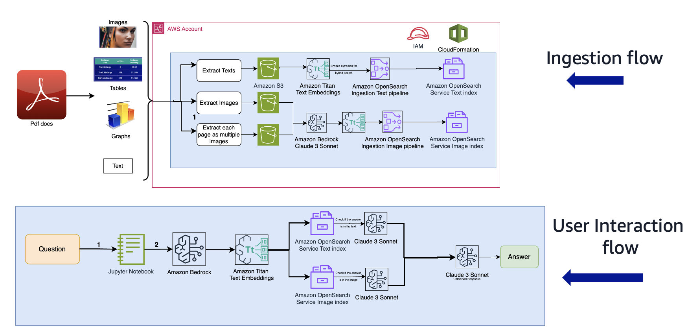

# Talk to your PDF files (Enhanced Multimodal RAG) using foundation models (FMs) hosted on Amazon Bedrock and Hybrid Search

This example shows an illustration of an enhanced RAG workflow to generate responses to user questions from multiple PDF files. This solution generates responses to user questions on texts, images, graphs, charts and other content provided in a large corpus of PDF files. This repository is divided into 5 main notebooks, each notebook representing an independent step. Developers/Users can run this repository notebook by notebook, or through a single command via the command line interface (view the _Running_ section below). This solution follows the main RAG workflow steps, such as ingesting text and image data from multiple PDF files into OpenSearch Serverless, utilizes foundation models to store text and image descriptions, convert them into embeddings, and gets inference from text, image, as well as combined (text and image) indexes. This solution also proposes another innovative evaluation method where you bring your own dataset of questions on the PDF files containing a pre existing target response/ground truth and use an LLM to judge which response best matches the ground truth. The evaluation solution measures quantitative metrics like `ROUGE`, `Cosine Similarity` scores and subjective metrics like _LLM as a judge_ evaluation metrics. The evaluation step at the end provides a [summary_analysis](notebooks/metrics/final_summary_analysis.txt) that contains the recommended strategy to use to get accurate responses for a given dataset/use case.

Additionally, this repo also shows how to use [LiteLLM](https://github.com/BerriAI/litellm) for interfacing with Bedrock and [Ray](https://github.com/ray-project/ray) for running Bedrock inference concurrently in an asynchronous manner.

## Prerequisites

1. **PDF Dataset**: In this directory, we provide with an option to use a publicly available [AWS whitepaper]('https://docs.aws.amazon.com/pdfs/whitepapers/latest/ml-best-practices-healthcare-life-sciences/ml-best-practices-healthcare-life-sciences.pdf#ml-best-practices-healthcare-life-sciences') as a PDF file on _machine learning best practices for healthcare life sciences_. If you want to bring your own custom PDF files, URLs, or a combination of both, then mention them in the [config.yaml](notebooks/config.yaml) file in the `content_info` section under `pdf_local_files` as given below. To use your custom pdf data, insert the files in a `pdf_data` local directory and mention the name of the files in the `pdf_local_files` list:

``` {.yaml}
content_info:
  local_files:
  - https://docs.aws.amazon.com/pdfs/whitepapers/latest/ml-best-practices-healthcare-life-sciences/ml-best-practices-healthcare-life-sciences.pdf#ml-best-practices-healthcare-life-sciences
  - <your-custom-pdf-file-name>

```

2. **Evaluation Dataset [Optional]**: Users have an option to use an `eval dataset` that with a question bank containing questions and ground truth answers on content from the PDF files provided. To use your own evaluation dataset, mention the name of your evaluation file in `eval_dataset_name` in the `eval_qna_dataset_info` section in the config file. Place this evaluation dataset in the [`eval_data directory`](eval_data/). Supported file formats are `csv`/`xls`/`xlsx` files. Change the `question_key` with the name of the column in your dataset that contains the questions, and the `target_response_key` to the name of the column that contains ground truth to the questions.

```{.yaml}
eval_qna_dataset_info:
  dir_name: eval_data
  eval_dataset_name: <name-of-your-evaluation-dataset.csv/xlsx/xls>
  question_key: Query
  target_response_key: Response
```

***To view all of the configuration file parameters, and tweak other parameters, view the parent config file here: [config_full.yaml](notebooks/configs/config.yaml).***

## Workflow

The following steps describe how this solution works. View the architecture diagram for this solution below:



## Use AWS CloudFormation template to create the solution stack

<i>This cloudformation stack will create an Amazon SageMaker Notebook Instance. After it is deployed navigate to _notebooks_ in the SageMaker Console.</i>

| AWS Region |                                                                                                                                         Link                                                                                                                                          |
|:----------:|:-------------------------------------------------------------------------------------------------------------------------------------------------------------------------------------------------------------------------------------------------------------------------------------:|
| us-east-1  | [](https://console.aws.amazon.com/cloudformation/home?region=us-east-1#/stacks/new?stackName=multimodal-blog4-stack&templateURL=https://aws-blogs-artifacts-public.s3.amazonaws.com/artifacts/ML-16123-4/template.yml) |
| us-west-2  | [](https://console.aws.amazon.com/cloudformation/home?region=us-west-2#/stacks/new?stackName=multimodal-blog4-stack&templateURL=https://aws-blogs-artifacts-public.s3.amazonaws.com/artifacts/ML-16123-4/template.yml) |


After the stack is created successfully, navigate to the stack’s
`Outputs` tab on the AWS CloudFormation console and note the values for
`MultimodalCollectionEndpoint` and `OpenSearchPipelineEndpoint`, we will
use it in the subsequent steps.

***Note: Since this code is work in progress and has not been merged to main, switch to the _8-pipeline-for-pdf-file-support_ branch to use the latest version of the code. Navigate to the _Blog4-PDF-TitanEmbeddings_ folder.***

### Data Preparation - Ingest and store PDFs using text and image files

1. The [1_data_prep_pdf_files.ipynb](notebooks/1_data_prep_pdf_files.ipynb) notebook handles data preparation for _PDF files_. It utilizes the PDF files mentioned in the config file, extracts text from each page of the PDF file using the `PyPDF2` library and stores each in a `.txt` file. It converts each page in the PDF file into an image and plans to crop it in 4 parts: _2 horizontal_ and _2 vertical_ halves and store it as `.jpg` files based on how many parts a user wants to split the image into. It then stores the extracted texts and images in an S3 bucket for further analytics and RAG workflow purposes. This notebook saves the entire page as a single image by default.

The user has the flexibility to choose from the following options to crop the image (or the `pdf page` as an image) as provided in the `page_split_imgs` section of the [config_full.yaml](notebooks/configs/config_full.yaml) file:

1. If you want to crop the `pdf image` vertically into two halves: a left half and a right half, set the `vertical_split` to yes.
1. If you want to crop the `pdf image` horizontally into two halves: an upper half and a lower half, set the `horizontal_split` to yes.
1. If you want to crop the `pdf image` both horizontally and vertically in 4 parts, set both the `horizontal_split` and `vertical_split` to yes.
1. If you do not want to crop the `pdf image` at all and save the PDF page as a single image, set both to `no`
1. Control the image resolution in the `image_scale`.
  
``` {.yaml}
page_split_imgs: 
  horizontal_split: no
  vertical_split: no
  image_scale: 3
```

All of these configurations can be set via the _config.yaml_ file in the `page_split_imgs` section. For the purpose of this repository, best results for PDF files were found with a whole image stored without cropping it, with the image resolution or `image_scale` set to a high score (in this case, 3).

*This directory has been tested with splitting the images in all possible permutations. For different use cases, PDF file structure, and content within those files, the best possible way to crop the images might change. This directory was tested with PDF files that were all of the similar structure, heavy in text, bars, charts and graphs.*

After extracting all of the texts and images from PDF files in separate text and image files, the files are sent to `Amazon S3` that provides a secure location for an enterprise to store these images and a multimodal model can read the texts/images directly from the S3 bucket.

### Data Ingestion - Storing the Image and Text files in separate indexes as embeddings

1. This portion of the workflow (notebook: [2_data_ingestion.ipynb](notebooks/2_data_ingestion.ipynb)) downloads the images and text files corresponding to the pdf file that we uploaded into Amazon S3 in the [1_data_prep_pdf_files.ipynb](notebooks/1_data_prep_pdf_files.ipynb) notebook. In this notebook, we get the image description from images using Claude 3 Sonnet and extract text from text files using [`NLTK`](https://www.nltk.org/) and `PyPDF`. We then convert both image and text content into embeddings and ingest these embeddings into a vector database i.e. [Amazon OpenSearch Service Serverless](https://aws.amazon.com/opensearch-service/features/serverless/) in two separate indexes (One **text only** index for text based content from the PDF file and one **image only** index for images stored from the file).

1. We use the [Anthropic’s Claude 3 Sonnet foundation model](https://aws.amazon.com/about-aws/whats-new/2024/03/anthropics-claude-3-sonnet-model-amazon-bedrock/) available on Bedrock to convert image to text descriptions.

1. We use the text extracted from each pdf page as is using the [_PyPDF](https://pypi.org/project/pypdf/)_ library and convert them into embeddings using [Amazon Titan Text Embeddings](https://docs.aws.amazon.com/bedrock/latest/userguide/titan-embedding-models.html) and store them in a text only index in OpenSearch Serveless. 

1. Each image file is first described using _Claude 3 Sonnet_ and then the embeddings of the image description are stored in an image only index in OpenSearch Serveless.

1. We use an `entities` field in the index body `metadata` to store entities from both images and texts in their respective image and text indexes. In this example, Entities are names of people, organizations, products and other key elements in the text. The entities from images are extracted using _Claude 3 Sonnet_ and entities from texts extracted files using `NLTK`. The purpose of extracting these entities is to later use them as a _prefilter_ to only retrieve relevant documents that have entities matching the entities from the user question, further enhancing the accuracy of the response.

1. The embeddings are then ingested into OpenSearch Service Serverless using the [Amazon OpenSearch Ingestion](https://docs.aws.amazon.com/opensearch-service/latest/developerguide/ingestion.html) pipeline. We ingest the embeddings into an OpenSearch Serverless index via the OpenSearch Ingestion API separately for text and images.

1. Both the image and text content is posted to the OSI endpoint and is stored locally as JSON files containing the text extracted from text files, image description of images, entities for both content types, file names, page numbers and file types for further evaluation and analytical purposes.

An example of a prompt that is used to get entities from an Image using _Claude 3 Sonnet_:

```
Human: Please provide a detailed description of the entities present in the image. Entities, are specific pieces of information or objects within a text that carry particular significance. These can be real-world entities like names of people, places, organizations, or dates. Refer to the types of entities: Named entities: These include names of people, organizations, locations, and dates. You can have specific identifiers within this, such as person names or person occupations.

Custom entities: These are entities specific to a particular application or domain, such as product names, medical terms, or technical jargon.

Temporal entities: These are entities related to time, such as dates, times, and durations.

Product entities: Names of products might be grouped together into product entities.

Data entities: Names of the data and metrics present. This includes names of metrics in charts, graphs and tables, and throughout the image.

Now based on the image, create a list of these entities. Your response should be accurate. Do not make up an answer.

Assistant:
```

***Entities from text files are extracted using [`NLTK`]***

### Enhanced Multimodal Retrieval Augumented Generation (RAG) Inference

1. The ['3_rag_inference.ipynb'](notebooks/3_rag_inference.ipynb) notebook performs several steps in a RAG pipeline to get accurate results based on user provided questions. This step takes in a user question, and extracts entities from that question using _Claude 3_. It uses the entities from the question to perform a `prefilter` by fetching relevant documents that have entities in its `metadata` that matches the entities from the user question. This step helps retrieve the most accurate results and relevant docs based on entities that matches the question entities. It then performs the following steps:

1. Uses an _LLM in the loop_ to go over each `k` hit (value of `k` is configurable in the config file) after vector retrieval, checks for if the answer to the question is given in that hit and if not, moves to the next `hit` until the answer is found. If the answer is not found in any, it returns ***I don't know***.

    1. For the text index, _Claude 3 Sonnet_ is used to check whether the question has the answer contained in the text extracted. If not, the LLM returns a "not found" and moves to the next text retrieval from the text index.
    
    1. For the image index, _Claude 3 Sonnet_ is used to check whether the answer to the question is provided in the image description. If not, Claude searches for the answer directly in the image using the image file path of the fetched image description. If the answer is not found in either, the LLM responds with a "not found" and moves to the next relevant hit to search for the answer.
    
    1. All valid responses (that are not "not found") that are fetched in this inference pipeline from both indexes are added to the context. The final context is used by a final LLM call to get the final combined response.

1. Uses an `eval dataset` that a user provides with a question bank.

1. This notebook goes through each question in the evaluation dataset, and uses the text only, image only and both indexes combined to provide responses to user questions and appends all the responses to a new data frame.

1. The retrieved results are stored in the [`metrics`](notebooks/metrics/) directory for further evaluations.

### Multimodal RAG Evaluation - `ROUGE`, `Cosine Similarity` & `LLM as a judge`

1. This notebook ['4_rag_evaluation.ipynb'](notebooks/4_rag_evaluation.ipynb) uses the CSV file generated in the `3_rag_inference.ipynb` notebook to run evaluations on each response from the `image`, `text`, and `combined` indexes.

1. It records the `ROUGE` and `Cosine Similarity` scores. For subjective evaluation, this notebook uses an LLM as a judge(in this case, ClaudeV3 Sonnet) in the loop to check for the best match answer and the source of that answer (from either the text index, image index, or both combined)

1. Records the evaluation results for responses from text only index, image only index, and combined indexes from OpenSearch

1. This notebook then gives an overview of an _LLM as a judge pick rate_ that shows which index response was picked as the most optimal strategy to use to correctly answer the user question and why.

1. After the LLM as a judge evaluation is complete, another final LLM is used (Claude 3 Sonnet) to go over the explanations and selections from the judge to provide an analysis and overall recommendation as to why a particular response source (index option) was chosen over the others.

1. This notebook uses _Claude 3 Sonnet_ as the LLM that acts as a judge. The prompt template for this LLM as a judge is in the [prompt_templates/eval_template.txt](notebooks/prompt_templates/claude_eval_template.txt) directory as follows:

```
Human: Your job is to find the best match answer to a question in the <question></question> tags based on the response candidates in the <candidate_responses></candidate_responses> fields. From the response candidates given below, find which the one that matches the target response in the <target_response></target_response> tags the best in terms of correctness, and explanation to the user question.
Put the best match response, response source and explanation for selecting the answer and not selecting other answers in a JSON as within 3 elements: "best_match_response", "response_source", and "explanation".
Your explanation should include both response source and answer so that it is simple to understand which response candidate was generated by which response source and why it was or was not selected.

<question>
{question}
</question>

<target_response>
{original_response}
</target_response>

<candidate_responses>
{candidate_responses}
</candidate_responses>

Do not select the target_response as the best_match_response. Only choose from the response candidates above.

Assistant: Here is the response in json:
```

## Contents

The example consists of 4 Jupyter notebooks and a couple of Python scripts:

- [1_data_prep_pdf_files.ipynb](notebooks/1_data_prep_files.ipynb) - This notebook contains the data preparation code. Prepares the images and texts from files and sends it to S3.

- [2_data_ingestion.ipynb](notebooks/2_data_ingestion.ipynb) - This notebook contains code to ingest the embeddings of images and text files into two OpenSearch serverless text and image indexes. 

- [3_rag_inference.ipynb](notebooks/3_rag_inference.ipynb) - This notebook uses performs a **Hybrid Search** and uses an _LLM in the loop_ to look up the most relevant data and parse through which data corresponds and gives the most appropriate answer to the user provided question.

- ['4_rag_evaluation.ipynb'](notebooks/4_rag_evaluation.ipynb) - This notebook summarizes the metrics and creates the results in human readable format. It gives quantitative (**_ROUGE & Cosine Similarity_**) and Subjective (**_LLM acts as a Judge_**) metrics to get the most optimal strategy to use for Multimodal RAG workflows.

- ['5_cleanup.ipynb'](notebooks/5_cleanup.ipynb) - This notebook cleans up the index and S3 resources. This notebook is for users to delete the index, the image and text files from the S3 bucket, to rerun this solution with new indexes, embeddings and data in S3 from the scratch.

- [main.py](notebooks/main.py) - Script to run all the notebooks through a single command. See section on `Running`.

- [config.yaml](notebooks/config.yml) - contains configuration parameters such as directory path, model information etc. for this solution.


## Prompt Templates

This repository uses the following prompt templates in the search process:

- [image_description_prompt.txt](notebooks/prompt_templates/image_description_prompt.txt) - This prompt is used to describe the images that are retrieved from S3. The image descriptions are generated, converted to embeddings and sent to OpenSearch serverless.
- [extract_image_entities_prompt_template.txt](notebooks/prompt_templates/extract_image_entities_prompt_template.txt) - This prompt is used to extract entities from a user question. These entities can be product names, people names, or anything that highlights the importance of your domain specific data. These entities are attached as metadata to the index body and sent to opensearch serverless. The purpose of these entities is that it acts as a prefilter during the process of hybrid search to only get the relevant documents.
- [extract_question_entities_prompt.txt](notebooks/prompt_templates/extract_question_entities_prompt.txt) - This prompt is used to extract metadata/entities from the user question. The metadata from the user question is used to match and get the similar documents in the image and text indices containing similar metadata/entities.
- [retrieve_answer_from_images_prompt.txt](notebooks/prompt_templates/retrieve_answer_from_images_prompt.txt) - This prompt is used to search for the answer to the user question during inference. The prompt asks to search for the answer in the image description. If the answer is not found in the image description, the answer is looked for directly in the image using the image path. If the answer is not provided from either of the search options, the model responds with a "not found" and moves to the next relevant image in the search process.
- [retrieve_answer_from_texts_prompt.txt](notebooks/prompt_templates/retrieve_answer_from_texts_prompt.txt) - This prompt is used to search for the answer to the user question in the text extracted from files. If the answer is not found in the text, then the model responds with a "not found" and moves to the next relevant text document in the search process.
- [final_combined_response_prompt_template.txt](notebooks/prompt_templates/final_combined_response_prompt_template.txt) - This prompt is used to gather all valid responses during the search process (from the image and the text index) and give a final response to the user question.
- [claude_eval_template.txt](notebooks/prompt_templates/claude_eval_template.txt) - This prompt is used by an LLM that acts as a judge, iterates through the responses from each index and provides information and evaluation on which index gives the best response for a specific dataset. This prompt template is for Claude. This can be changed/adapted to a model of your choice with a new template.
- [claude_final_summary_analysis_prompt.txt](notebooks/prompt_templates/claude_final_summary_analysis_prompt.txt) - This prompt is used by an LLM to go over all of the subjective evaluations done by the LLM that acts as a judge, and provide trends and patterns as to which index strategy to choose based on the results from the dataset. This prompt template is for Claude. This can be changed/adapted to a model of your choice with a new template.

### Dataset

The dataset used in this repo is a publicly available AWS Whitepaper which is used in 1_data_prep_files.ipynb as a `request.get`. You can use your own public urls or place your custom PDF files manually in the `PDF_data` directory. Mention the urls and PDF files you wish to run through in the config.yaml file under the `content_info` section.

## Setup

It is best to create a separate conda environment to run this solution using the commands provided below:

```
conda create --name multimodal_python311 -y python=3.11 ipykernel
conda activate multimodal_python311
pip install -r requirements.txt -U
```

Use the `multimodal_python311` conda environment for all notebooks in this folder.

## Running

Run the following command which will run all the notebooks included in this repo in the correct order.

```{.bash}
rm -rf data/metrics
python main.py
```

You could also run the notebooks manually in the order given above.


## Tip

Note that you can use OpenSearch Dashboards to interact with the
OpenSearch API to run quick tests on your index and ingested data.


## Cleanup

To avoid incurring future charges, delete the resources. You can do this
by deleting the stack from the CloudFormation console.


